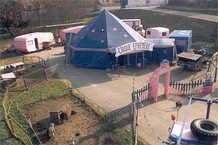

# Cirque Ephémère

## Contacts

|     |
| --- |
| Salsifis, Kendy & Pierre-René Massard |
| 166 rte de Songy-Grossaz |
| 74160 Feigères |
| Tel: +33 (0)4 50 35 15 52 |
| Mobile: +33 (0)6 80 25 82 63 |
| [sals.massard@wanadoo.fr](mailto:sals.massard@wanadoo.fr) |
| ass. loi 1901 no 4986 |

## 

## TV Segments FR3-19/20 September 2005

- [Low Quality](http://askpascal.com/wikidocs/ephemere/ephemere_1920-100905%20low.wmv)
- [High Quality](http://askpascal.com/wikidocs/ephemere/ephemere_1920-100905%20high.wmv)
- [Sur YouTube](http://www.youtube.com/v/yZhwF5t7PrE&hl=en&fs=1)
- [Aldebert et ses potes au Cirque Ephémère](http://www.youtube.com/watch?v=eybmTgsBohE)     

## Links

[Cirque Ephémère](http://www.cirque-ephemere.com/)

## Biography

En 1982 Pierre-René Massard crée avec une dizaine de jeunes gens le Cirque Badaboum qui durant l’été sillonnera les villages environnants: la voüte des cieux sert de chapiteau, les cours d’école d’enceinte et les bancs des salles des fetes de gradin.

En 1984 les deux rescapés du groupe Pierre-René et Véronique (Salsifis) montent dans la salle la << Barque>> aux Pâquis à Genéve le premier spectacle du Cirque Ephémère.

En mai 1985 les deux ainsi que deux membres du groupe de monocyclistes Aldebert et ses potes (Pascal et Christian ) qui sont venus les rejoindre construisent de leurs petites mains <<le plus petit chapiteau du monde >>.

En juillet 1985 débute la premiere toumée d’été, sous chapiteau du Cirque Ephémère. En juillet 1986 le Cirque Ephémère se constitue en <<Association loi 1901 à but non lucratif>> s’en suit galas pour Centre de Loisirs, Ecoles, Office de Tourisme, Comites d’Entreprise et aussi mois du cirque avec exposition, ateliers d’ initiations aux disciplines du cirque, <<Histoire du Cirque>> sous forme de montage audio visuel vont se succéder.

En février 88 à Germagny commune de Viry et à l’époque siege du Cirque Ephémère le chapiteau est monté pour un mois et le trio d’Aldebert et ses Potes (le troisième partenaire Philippe a rejoint Pierre-René et Salsifis), le succès est foudroyant, on refuse du monde et bien sur les spectateurs venus de Genève.

Avril 89 l’équipe s’est renforcé d’Antoine et Jean-Marie et réitère l’expérience en Suisse : 3 semaines de prévues et un mois et demi de succès.

Et depuis chaque année verra la creation d’un nouveau spectacle.

Jean-Marie quittera le cirque pour devenir la vedette de Malabar puis créera la compagnie Couleur Mécanique.

De spectacle en spectacle de nouveaux venus feront leur apparition sur la piste, Titi, Etienne, Manu, Tristan, Nicolas (plus tard les Points de Suspension), Carole et Greg (le Cirque Troc) et les membres plus ou moins lointains de la famille : Sara (entre autres créatrice de Kaba’rêves), Bianca (danseuse de flamenco), Elias (photographe international) etc…. Tous ne sont pas restés dans le monde du spectacle mais beaucoup. Et ce sont eux ainsi que ceux qui ont activement participés à la vie de notre cirque (les Strapontins, Thierry Nadalini & Grégor Kiock et la famille Fubby)que pour le Festival des vingt ans du Cirque Ephémère vous avez retrouvés.

<<Crocus Circus>> a vu en 2006 l’arrivée de nouveaux éléves: Delphine, Celine, Valentin (7ans) et pour 2007 on attend Jimmy et Jordan.

Sachez également que le Cirque Ephémère crée réguliérement des spectacles de chansons et textes, << P.R. chante le cirque>>, <<De l’autre côté de Prévert>>, <<Drôles d’airs >>, <<Mon oursin et moi >>de F. Blanche et pour octobre-novembre 2006 <<Boris Vian>>.